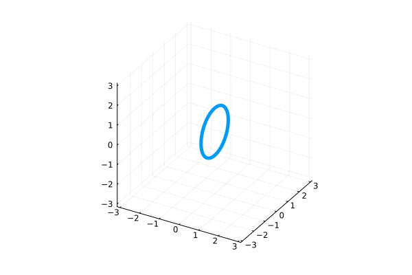

# Single vortex ring

*Initialises a single, vortex ring of size ``R``.*



## Usage
```julia
struct SingleRing{A} <: InitCond
    Radius::A
end
```
Vortex ring in the ``yz``-plane, propagating in the ``x`` direction. Use the field `Radius` to set the radius of the vortex ring.

```julia
#Set an initial condition of ring size 1.0
IC = VortexFilament.SingleRing(1.0f0)
```