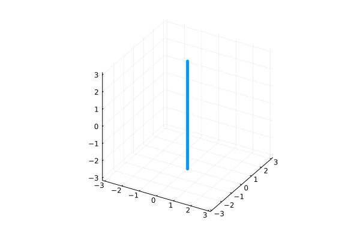

# Straight line 

*Initialises a single, straight line vortex at the centre of the computational box.*



## Usage
```julia
struct SingleLine <: InitCond
end
```

To set up a single vortex line, simply pass `SingleLine()`.